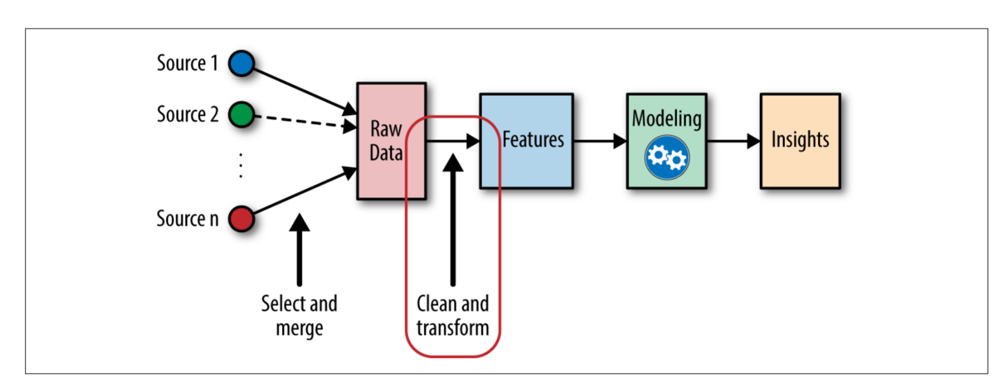

# ML Pipeline Notes

## Data
- observations of real-world phenomena.
### Examples
    - personal biometric  data
      - minute by minute heart rate
      - blood sugar level
      - blood pressure
    - coustomer intelligence data
      - "alice bought two books on sunday"
      - "bob browsed these pages on the website"
      - "charlie clicked onthe special offer link from last week"
  - each piece of data sprovides a small widnointo a limeited aspect of reality.  The collection of all of these observations gievs a piture of the whole. But the picure is messy bc its composed of  a thousand  litle pieces, and there's always a measurement noice and missing pieces.

## Task

Why do we collect data?,how can we udnerstand our coustomer's changing taste, so that our business can serve them better?
- The path from data to ansers is fullof false starts and dead ends.

The bread and butter of machine learning can be based on two factors
> models and features

## Models

The language of statistics condatins concepts for many freaquent characteristics of data, such as
- *wrong*
- *redundant*
- *missing*

**Wrong data** is the resutl of a mistate in measurement,
**redundant data** contains multiple aspects that convey exacly the same information.
**missing data** data points that are not present that should be in the dataset.

### Mathematical model
describes the relationship between different aspects of the data.

  - model that predicts stock prices might be a formula that maps a company's earing history, past stock prices, and industry to the predicted stock price.
- A model that recomends music migh measure the similarity between users(based on their listening habits), and recomend the same artist to users who have listened to a lot of the same songs.

Relates numeric quantities to each other, but raw data is often not numeric.  example:*"Alice bought The Loard of the Rings trillogy on Wednesday"* is not numeric. There must be apiece that connects the two together. This is where features come in

### Features

A Feature is a numeric representation of raw data.
There are many ways to turn raw data int onumeric measurements, which is why features can end up looking like a lot of things.

The right features are relevant to the taks at hand and should be easy fo the model to ingest.
**Feature engineering** is the process of formulating the most appropriate features given the data, the model, and the task.

The numer of features is also important, if there are not enough informative features, then the model will be unable to perform the ultimate task.  If there are too many features, or if most of them are iirelevant, then the model will be more expensive and tricky to train.

## Model Evaluations

Features and models sit between  raw data and the desire insight. In ML workflow, we pick not only the model but also the featues. This is a double-jointed lever, and the choice of one affets the other.

- Good  features make the subsequent modeling steps easy and the resulting model more  capable of comppleting the desired task.
- Bad features may requre a much more complicated model to achieve the same level of performance.

