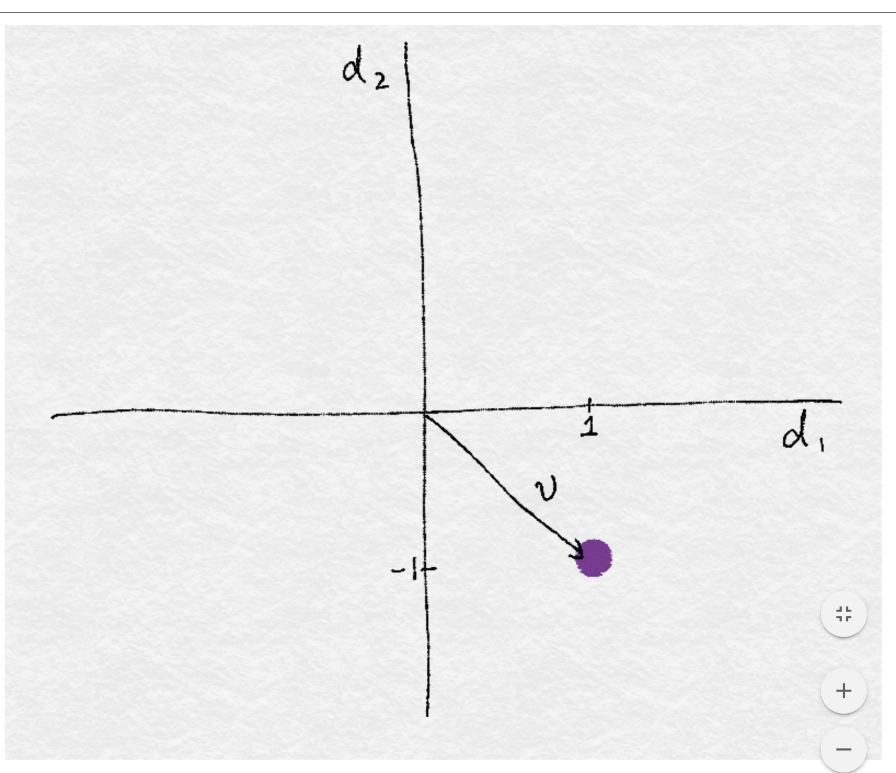
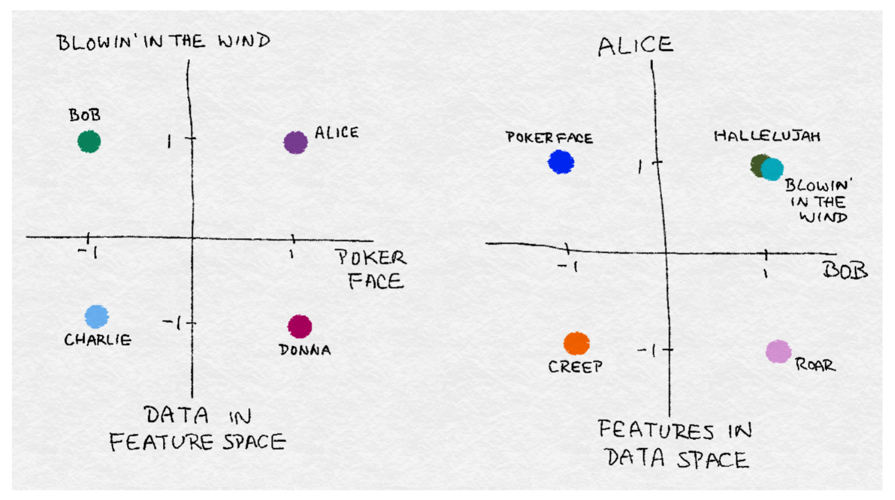
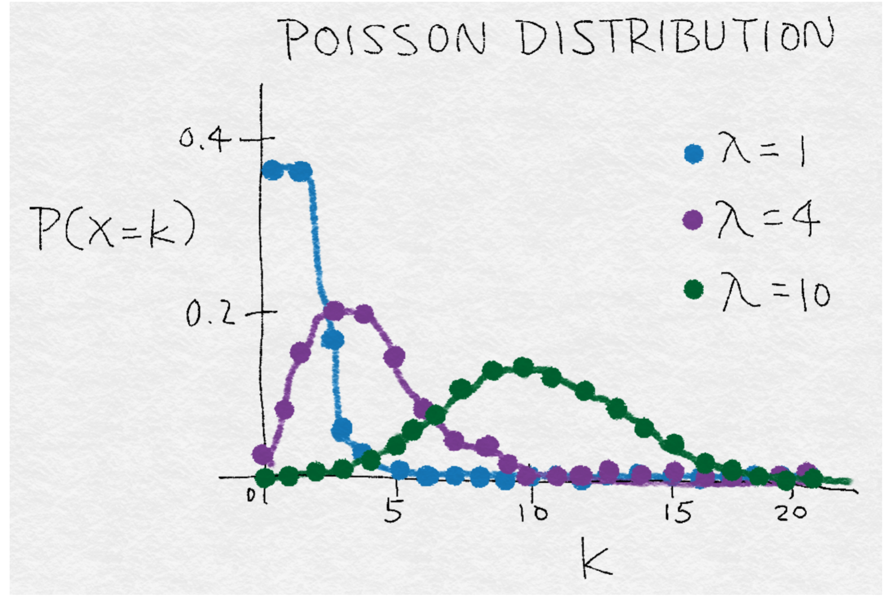

# Fancy Tricks with Simple Numbers

## Working with numerical data
It comes in variety of sources
- geolocation of a place or a person
- price of a purchase
- measurements from a sensor
- traffic counts

Numerical data is in a format that's easily ingestible by mathematical models.  This does not mean that feature enginiring is no longer necessary, though.  Good features should not only represent salinet aspecs of the data, but also conform to the assumptions fo the model.

### Sanity check
The fist santity check for numerical data is whether the magniture matters.
- do we need to know whether it's positive or negative?
- do we need to  know the magniture at a very corse granularity?

Sanity check  is particulary important for automatically accrued numbers such as counts--the number of daily visits to a website, the number of reviews garned by a restaurant, etc

### Scale of features
- what are the largest/smalest values?
- do they span several orders of magniture?

Models that are smooth functions of input features are sensitive to the scale of the input.  examples include *k*-means clustering, nearest neighbors method, radial basis functions (RBF) kernels, and anything that uses teh ***Ecludian distance***.  For these models and modeling componets, it is ofhter a good idea to *normailze* the features so that the output stays on an expected scale.

#### Logical functions
Logical functions are not sensitive to inpute featuer scale. The output is binary no matter what the inputs are.

#### Decision tree models
Decision tree models consic of step functions of input features, hence models based on space-partitioning trees:
- decision trees
- gradient boosted machine
- random forest

... are not sensitive to scale.  The only expection is fit eh calse of theinput grows over time

#### Distribution of numerical features
Distribution summarizes teh probability of taking on a particular value, it matters to some models more than others.

example
- training process of a linear regression model assumes that prediction errors are distributed like a Gaussian.  This is usually fine, except when the prediciton target spreds out over several ordersof magnitude. In this case, Gaussian error assumtions likely no linger holds.
  - One way to deal with this is to transform the output target in order to tame the magniture of the grouth.
  - log transforms, which are a type of *power transform*, take the distribution of the variable closer th Gaussian.

## Scalar, Vectors, and spaces..oh my

Lets define some basic conscepts.
-  ***scalar*** is a single numeric feature.
-  ***vector*** is an order list of scalars
-  ***vector space*** is were vectors sit within.

In  vast mahority of ML applications, the input to a model usulally represented as a numerical vector.

A vector can be vusualize as a point in space. example suppose we have a two-dimesional vector $v=[1,-1]$.  The vector contains two numbers
- in the first direction, $d_1$ the vector has a value of 1
- in the second direction $d_2$ has a value of -1

We can plot $v$ in a 2D plot

### Feature space and data space

In the world of data, abstract vector and its featues dimensions take on actual meaning. example:
- vector can represent a person's preference for songs
  -  each song is a feature, where  val of 1 is equivalent to a "thumbs-up" and -1 to a "thumbs-down"
Suppose the vector $v$ represents the preference of a listener, Bob.  Bob likes "Blowing' in the Wind" by bob dylan & poker face by lady gaga.  Other people migh have different preferences.  Collectively, a collection of data can be visualizes in ***feature space*** as a point cloud.

Conversely, a song ca be represented by the indivivual preference of a group of people.

Suppose ther are only two listeners, Alice & Bob.

Alice  likes "poker face", "blowing in the wind" and "Hallelujah" but hates Katy perry "Roar" and Radiohead's "Creep".  Each song is a point int he space of listeners.

## Dealing with Counts

- When data can be prodced a t highly vol and velocity, its very likely to contain a few extreme values.
- Its a good idea to check the scale and determine whter to keep the data as rea nums, convert them into binary vals to indicate presence, or to bin them onto coarser granularity.

### Binarization
> see notebook

## Power Transfort: Generalization of the Log Transform

The **log transform** is a specific example of a family of tranformation knowns as *power transformas*, in statistical terms, thesea are  *variance-stabilizing transformations*.

#### Poissons distribution
- this is a heavy-tailed distriution with a variance that is equal to its mean
  - the larger its center of mass, the larger its variance, and heavier the tail.

A simple generalization of both the square root transform and the log transform  is known as the **Box-Cox** transform.
$$
\tilde{x}= \Bigg\{\frac{\frac{x^{\lambda}-1}{\lambda}, \text{if}\,\lambda \neq0}{\ln(x)\, \text{if}\,\lambda \neq0}
$$